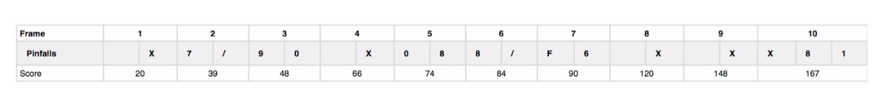
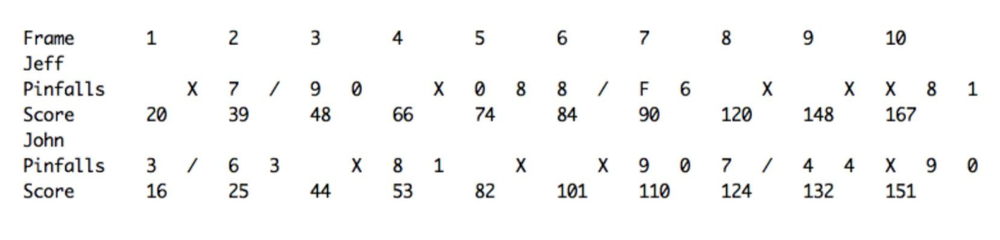
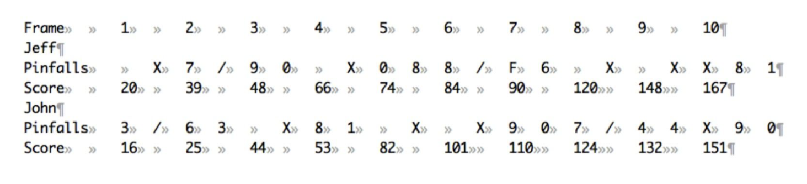
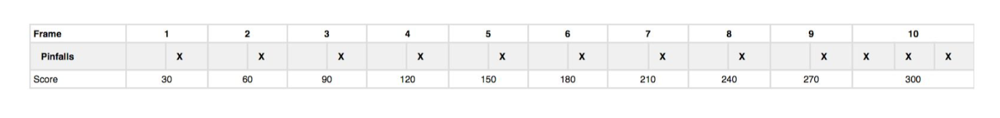
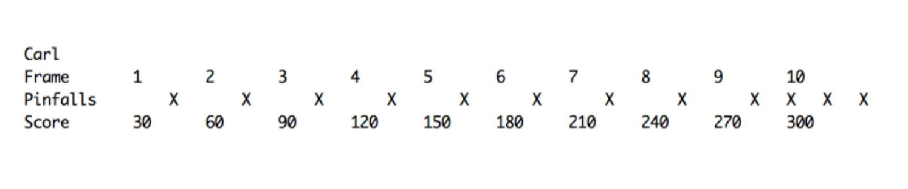

# Reglas del Proyecto

Texto del documento:

Create a command-line application to score a game of [ten-pin bowling](https://en.wikipedia.org/wiki/Ten-pin_bowling).

1. The program should run from the command-line and take a text file as input: ‘bowling-game.txt’
2. The content of the input text file (e.g., ‘game.txt’) for several players bowling 10 frames each. This would be like:

```
Jeff 10
John 3
John 7
Jeff 7
Jeff 3
John 6
John 3
Jeff 9
Jeff 0
John 10
Jeff 10
John 8
John 1
Jeff 0
Jeff 8
John 10
Jeff 8
Jeff 2
John 10
Jeff F
Jeff 6
John 9
John 0
Jeff 10
John 7
John 3
Jeff 10
John 4
John 4
Jeff 10
Jeff 8
Jeff 1
John 10
John 9
John 0
```

  a. Each line represents a player and a chance with the subsequent number of pins knocked down.
  b. An 'F' indicates a foul on that chance and no pins knocked down (identical for scoring to a roll of 0).
  c. The input shall be valid (i.e., no chance will produce a negative number of knocked down pins or more than 10, etc). d. The rows are tab-separated.

3. The program should then output the scoring for the associated game. So for the above game for Jeff, the classic scoring would be written:



Your program should print out a similar score to standard out, in the format:



Here is the same output with hidden whitespace revealed:



  a. For each player, print their name on a separate line before printing that player's pinfalls and score.
  b. All values are tab-separated.
  c. As seen into the above output, the output should calculate if a player scores a strike ('X'), a spare ('/') and allow for extra chances in the tenth frame.

4. Your code will be evaluated on:

  a. Clarity, design, extensibility and maintainability.
  b. Testing and code coverage (e.g., for Ruby programs, using JUnit or other unit testing frameworks).

**Further help:**

Your program should be able to handle all possible cases of a game both including a game where all rolls are 0, all rolls are fouls (F) and a perfect game, where all rolls are strikes:

```
Carl 10
Carl 10
Carl 10
Carl 10
Carl 10
Carl 10
Carl 10
Carl 10
Carl 10
Carl 10
Carl 10
Carl 10
```




